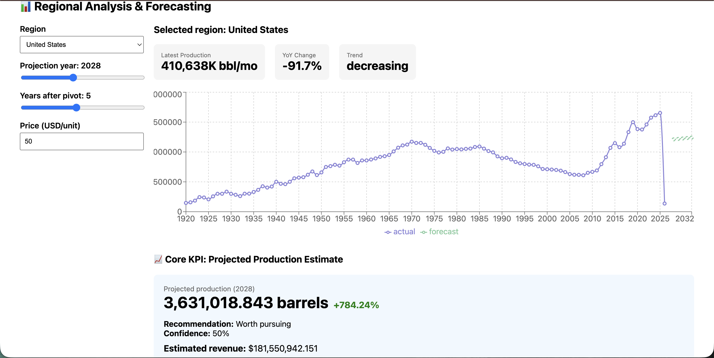
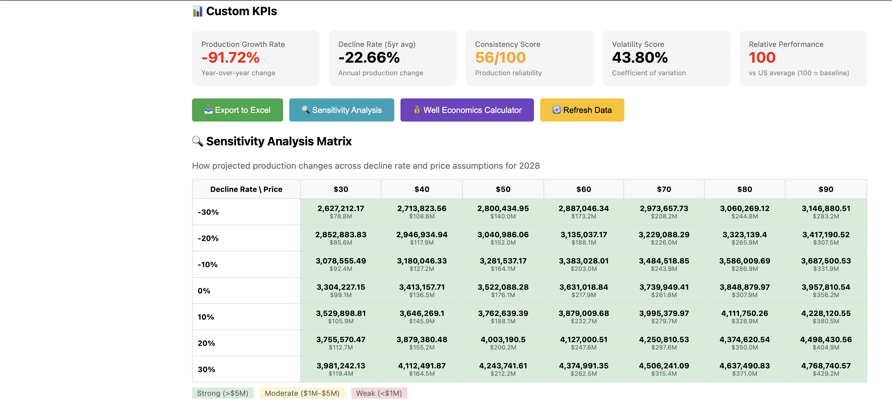
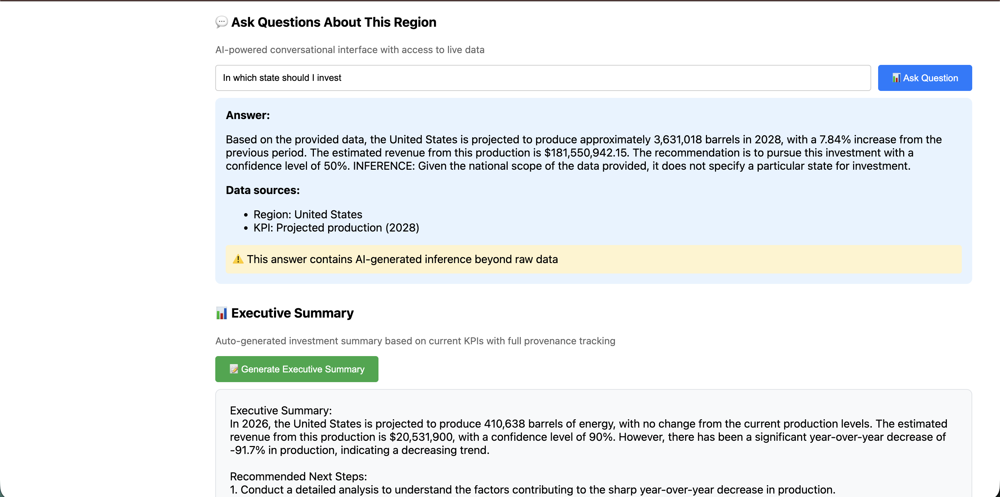

## 📸 Screenshots

### Regional Analysis Dashboard

### Sensitivity Analysis Matrix

### AI-Powered Features

## 🤖 AI-Powered Features

This system includes three AI-powered features that add genuine analytical value:

### 1. 🗺️ Interactive Geographic Visualization
Explore regional oil and gas production data on an interactive map with geographic context. Click any region to instantly update the forecasting dashboard.

**Features:**
- Interactive Leaflet.js map with clickable state markers
- Visual encoding: color (trend), size (production volume), border (selection)
- Real-time data overlays showing production, YoY change, and trend
- Seamless integration: clicking a region updates all forecasts and KPIs
- Legend and tooltips for easy interpretation

**Regions covered:** All 50 US states plus national aggregate (51 total regions)

### 2. 💬 Conversational Interface
Ask natural language questions about regional production data and forecasts. The AI has access to live data and clearly distinguishes between data-backed answers and AI-generated inference.

**Example questions:**
- "What is the production trend for Texas?"
- "Should we invest in this region?"
- "How does the projection compare to historical performance?"

**Key features:**
- Grounded in live EIA data (not just training data)
- Provenance tracking: every fact is sourced and displayed
- Clear distinction between data-backed claims and AI inference
- Answers include specific numbers from current data

### 3. 🔍 Anomaly Detection
Automatically flags unusual production patterns using statistical analysis. Helps analysts quickly identify years requiring deeper investigation.

### 4. 📊 Executive Summaries
Auto-generates investment summaries based on current KPIs with full provenance tracking. Every fact used in the summary is displayed for verification.

**Setup:** Set `OPENAI_API_KEY` environment variable to enable AI features. The system gracefully degrades without it.

These advanced features significantly strengthen the analytical capabilities:

### 📊 Custom KPIs
Five additional metrics beyond projected production:
- **Production Growth Rate** — year-over-year percentage change
- **Decline Rate** — 5-year average production trend
- **Consistency Score** — how reliably a region produces (0-100)
- **Volatility Score** — coefficient of variation in production
- **Relative Performance Index** — region vs US average (100 = baseline)

All KPIs are clearly defined in `docs/kpi_definitions.md` and displayed with color-coded indicators.

### 📥 Excel Export
Formula-driven spreadsheet export for downstream analysis:
- Editable input parameters (price, growth assumptions)
- Historical data with year-over-year calculations
- Forecast formulas that reference input cells
- KPI summary with Excel aggregation functions
- Not just a data dump — analysts can modify assumptions and extend analysis

### 🔍 Sensitivity Analysis
Interactive matrix showing how projections change across input variables:
- 7×7 heat map (decline rate vs price)
- Color-coded cells: green (strong), yellow (moderate), red (weak)
- Shows production volume and estimated revenue for each scenario
- Tied to year selector for exploring forecast horizon
- Helps stress-test assumptions and identify opportunity quality

### 📋 Data Provenance
Every number is traceable:
- Source: EIA API series ID displayed
- Last updated timestamp on KPI cards
- Live data refresh with status indicators
- Clear distinction between actual vs forecasted values
- Provenance panel in executive summaries

### 🔄 Live Data Refresh
On-demand data updates:
- Manual refresh button fetches latest from EIA API
- Loading states and timestamps
- Graceful degradation to cached data on API failure
- Status messages: 'live', 'cache', or 'cache-fallback'
- Color-coded indicators (green=fresh, yellow=cached)

### 💰 Well Economics Calculator
Interactive financial model for horizontal oil wells:
- **Editable inputs:** initial rate, decline parameters, drilling cost, OPEX, price, discount rate
- **Calculated outputs:** EUR, NPV @ 10%, IRR, payback period
- **Visualizations:** production decline curve, cumulative cash flow chart
- **Client-side calculation:** instant updates when inputs change
- **Regional defaults:** Pre-filled with reasonable assumptions (future enhancement)

All calculations run in real-time with full transparency.

Application built by Shiva Sai Pavan Inja
